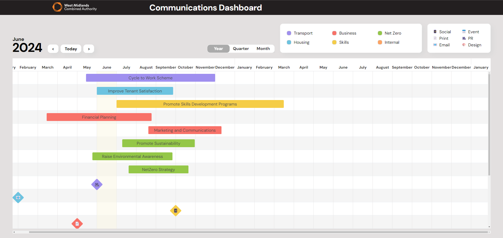

# Timothy Bridge
As a pet photographer for many years, 
I am now eager to bring my creativity and problem-solving skills to the tech world. 
After completing the intensive School of Code program, 
I have developed a true passion for coding. 
Turning a few lines of code into an interactive experience is incredibly exciting to me, 
and I am ready to take on new challenges.

The project I am most proud of being the -

Communications Dashboard

A campaign management dashboard that provides the DOC at WMCA with an easy-to-navigate view of all her upcoming,
present, and previous campaigns.
It is split into a 12-month view, quarterly view, and monthly view.
This dashboard was created to address the shortcomings in the stakeholders' current campaign management solution.

[Deployed Version](https://communicationsdashboard-timothyredpandas-projects.vercel.app/)

Quote from our project Stakeholder:

> “The team really listened to what I needed,
> incorporated everything I wanted into the tool
> and even achieved some stretched goals we had set.
> They worked quickly and created a workable and visually
> appealing product.” Siobhan Bassford, DOC

## My Tech Stack

