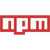

## Welcome
Welcome to the GitHub, we've got fun and games...wait that ain't quite right. I think I may of got those Guns and Roses lyrics slightly wrong. So we shall move swiftly on. I'm Timothy and after being a photographer for 9 years I decided to take on some new challenges. Bring my creative thinking and attention to detail to new aspects of life.

This is what lead me to the [`School of Code`](https://schoolofcode.co.uk/) intensive bootcamp. Working with a agile mindset we had weekly sprints to cover the whole product lifecycle. This was not only incredibly rewarding but gave me the ability to build, iterate and learn fast. I still have a passion for my photography but I am absolutely loving the software development world and have really found my vocation.

Thank you for checking out my GitHub and feel free to browse the projects - I have pinned some of my favourites.

## Current Tech Stack
#### Main Skill Set:

``` javascript
const currentSkills = [
    "JavaScript",
    "TypeScript",
    "React",
    "Next.js",
    "HTML",
    "CSS",
    "SCSS",
    "Tailwind",
    "Vite",
    "StoryBooks",
    "Git",
    "GitHub",
    "NPM",
];
```





### My Favourite Projects

I have pinned my favourite projects but in short I am especially proud of the following projects:

1) [Red Panda Portfolio/Studio](https://github.com/TimothyRedPanda/red-panda-portfolio): I continually beaver away at this not only to solidify my own knowledge but help other developers just starting out on their journeys. I am really proud of how it is coming togother and loving the journey.

2) [Red Panda Components/Icons](https://www.npmjs.com/settings/timothypandacode/packages): I am especially proud of having three npm packages published. A component library and icon library included. I want to make them a bit more feature rich when I get the chance. But Red Panda Studio and Eco Leap take priority currently.

3) [Red Panda UI](https://github.com/TimothyRedPanda/redpanda-ui): Fully Jest tested UI components built in React using TypeScript and published on NPM for other developers to use.

### Where can you connect with me:
Feel free to connect with myself on [LinkedIn](https://www.linkedin.com/in/timothybridgecode/) for all things Timothy and to follow my journey. Looking forward to connecting with ya.

## Thank you again for visiting!
